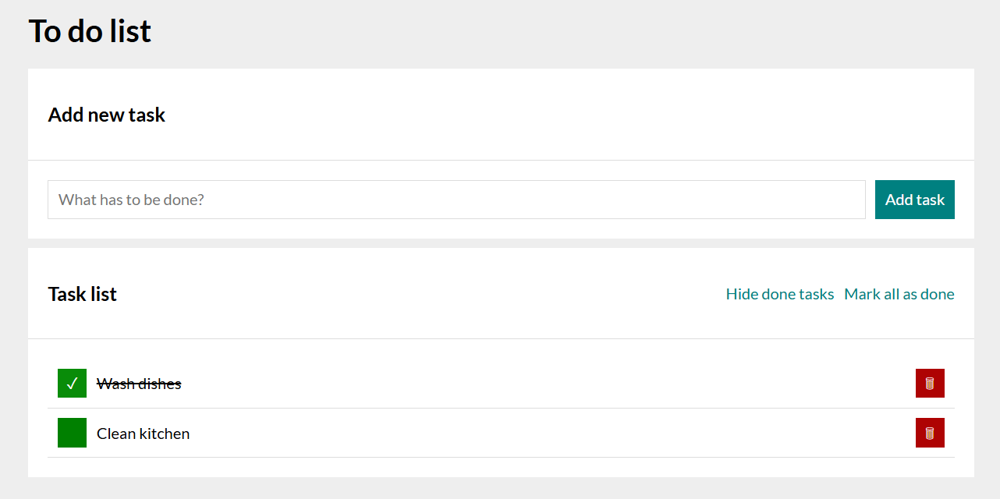
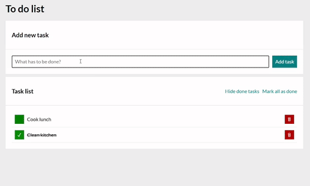

# To do list 

Make your day to day life easier with this simple app that will allow you to manage your daily tasks!

## Description

This project was bootstrapped with [Create React App](https://github.com/facebook/create-react-app).

With this app, users can:
- **Add new task** - by clicking **Add task** button or by simply pressing Enter button on keyboard. Once task is added, focus is set to input field
- **Mark task as completed** - by clicking the green field which appears on left-side of the task (after marking a task as completed, a checkmark emoji ✅ will appear within green field and task will be crossed out)
- **Delete task** - by clicking the red field with trashbin 🗑️ icon a specific task is removed
- **Mark all as done** - by clicking this button, all tasks will be marked as completed (upon marking all as completed the above mentioned button will not be available)
- **Hide/Show done tasks** - this option will toggle and hide or show the tasks that are marked as completed

App prevents adding new task in case only spaces or no value is set in the ***What has to be done?*** field. 

In case there are no tasks added, ***Hide done tasks*** and ***Mark all as done*** options will not be visible.

A quick visual presentation of the app:

[Try out the app!](https://patkolino.github.io/ToDoList-React/)

## Technologies

- **React** 
    - **useState** & **useEffect** for managing component state and side effects 
    - **Custom Hooks** - Reusable functions that simplify and organize logic within app (`useTasks` handles all tasks logic)
- **Create React App** - Project bootstraped using CRA which includes:
    - **Babel** - Automatically transpiles modern JavaScript and JSX for compatibility
    - **WebPack** - Bundles assets and modules efficiently
- **Styled Components** - CSS directly applied in JavaScript, keeping code simpler and easier to manage and read. `GlobalStyles` and `theme` were added as well.
- **normalize.css** - Installed via npm to ensure consistent styling across different browsers
- **Responsive design** - Custom layout and styling for mobile and desktop views
- **Web Storage API** - Uses `localeStorage` for data persistence (tasks)

## Available Scripts

In the project directory, you can run:

### `npm start`

Runs the app in the development mode.\
Open [http://localhost:3000](http://localhost:3000) to view it in your browser.

The page will reload when you make changes.\
You may also see any lint errors in the console.

### `npm run build`

Builds the app for production to the `build` folder.\
It correctly bundles React in production mode and optimizes the build for the best performance.

The build is minified and the filenames include the hashes.\
Your app is ready to be deployed!

See the section about [deployment](https://facebook.github.io/create-react-app/docs/deployment) for more information.